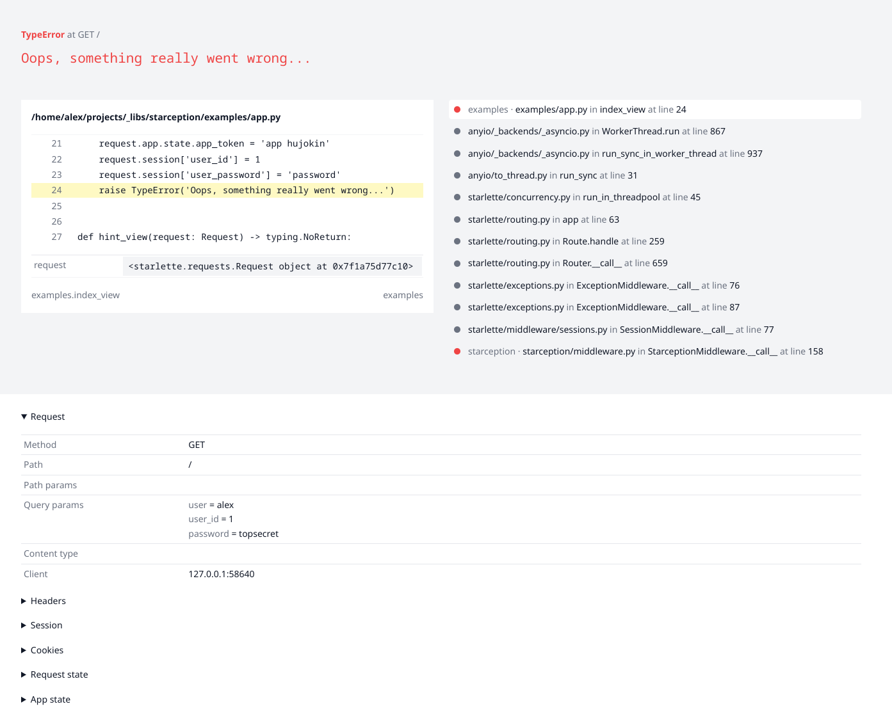
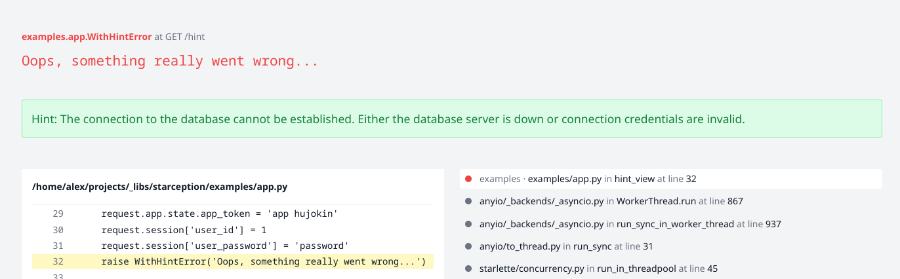

# Starception

Beautiful debugging page for Starlette apps. Look and feel inspired by Elixir Phoenix.


## Installation

Install `starception` using PIP or poetry:

```bash
pip install starception
# or
poetry add starception
```

Add it as the first middleware in to your app:

```python
app = Starlette(
    middleware=[
        Middleware(StarceptionMiddleware, debug=True),
        # other middleware here
    ],
)
```

Note, the middleware won't handle anything if `debug=False`,
instead it will display plain string "Internal Server Error".
Also, I would recommend to add it only for local development, as such error page,
when enabled on prod by mistake, can expose sensitive data.

## Screenshot



## Features

* secrets masking
* solution hints
* code snippets
* display request info: query, body, headers, cookies
* session contents
* request and app state
* platform information
* environment variables

The middleware will automatically mask any value which key contains `key`, `secret`, `token`, `password`.

## Quick start

See example application in `examples/` directory of this repository.

## Solution hints

If exception class has `solution` attribute then its content will be used as a solution hint.

```python
class WithHintError(Exception):
    solution = (
        'The connection to the database cannot be established. '
        'Either the database server is down or connection credentials are invalid.'
    )
```


