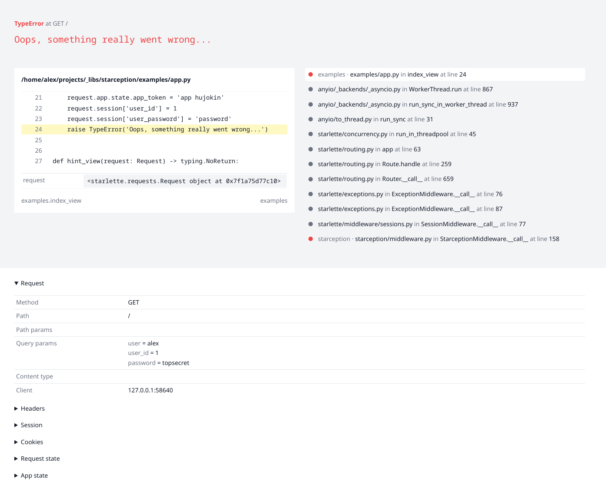
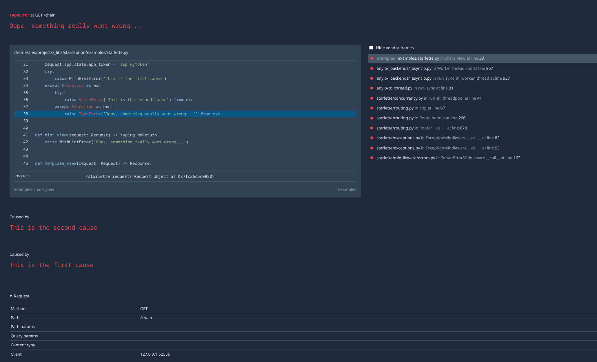
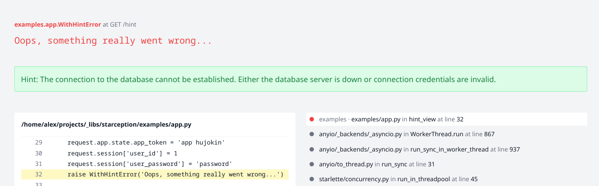
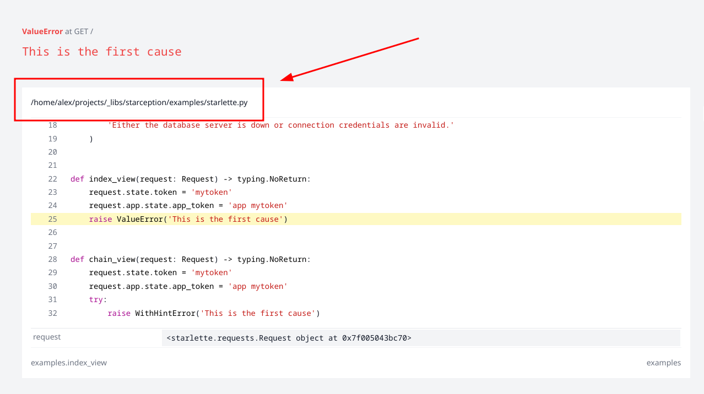

# Starception

Beautiful exception page for Starlette and FastAPI apps.


## Screenshot



<details>
<summary>Dark theme</summary>
<div>
    
</div>
</details>

## Features

* secrets masking
* solution hints
* exception notes (Python 3.11+)
* code snippets
* display request info: query, body, headers, cookies
* session contents
* request and app state
* platform information
* environment variables
* syntax highlight
* open paths in editor (VSCode; extensible via custom link templates)
* exception chains
* dark theme

Starception automatically masks any value whose key contains `key`, `secret`, `token`, or `password`.

## Installation

Install `starception` using pip or uv:

```bash
pip install starception
# or with uv
uv add starception
```

### With syntax highlight support

If you want syntax-highlighted code snippets, install with the `highlight` extra:

```bash
pip install starception[highlight]
# or with uv
uv add starception[highlight]
```

## Quick start

See example application in [examples/](examples/) directory of this repository.

## Usage

Starception works only in debug mode — make sure `debug=True` is set on your app.

Call `install_error_handler` before creating your application instance:

**Starlette**

```python
from starception import install_error_handler
from starlette.applications import Starlette

install_error_handler()
app = Starlette(debug=True)
```

**FastAPI**

```python
from starception import install_error_handler
from fastapi import FastAPI

install_error_handler()
app = FastAPI(debug=True)
```

### Integration with other frameworks

`starception` exports `starception.exception_handler(request, exc)`, which you can use directly.
Keep in mind that Starlette will [not call](https://github.com/encode/starlette/issues/1802) custom exception
handlers in debug mode — it always uses its built-in one.

The snippet below will **not** work as expected (unfortunately):

```python
from starlette.applications import Starlette

from starception import exception_handler

app = Starlette(
    debug=True,
    exception_handlers={Exception: exception_handler}
)
```

Use `install_error_handler()` instead (shown above).

## Solution hints

If an exception class has a `solution` attribute, its content will be shown as a hint.

```python
class WithHintError(Exception):
    solution = (
        'The connection to the database cannot be established. '
        'Either the database server is down or connection credentials are invalid.'
    )
```



## Exception notes

Python 3.11+ supports attaching notes to exceptions via `add_note()`. Starception displays them on the error page.

```python
err = ValueError("something went wrong")
err.add_note("Check that the config file exists and is readable.")
raise err
```

## Opening files in editor

Set your editor to make file paths in stack frames clickable:

```python
from starception import set_editor

set_editor('vscode')
```



### Registering custom link templates

If your editor is not supported, register it with `add_link_template`:

```python
from starception import set_editor, add_link_template

add_link_template('zed', 'zed://file/{path}:{lineno}')
set_editor('zed')
```

> Note: VSCode is supported out of the box. PRs for additional editors are welcome.

## Credits

* Look and feel inspired by [Phoenix Framework](https://www.phoenixframework.org/).
* Icons by [Tabler Icons](https://tabler-icons.io/).
