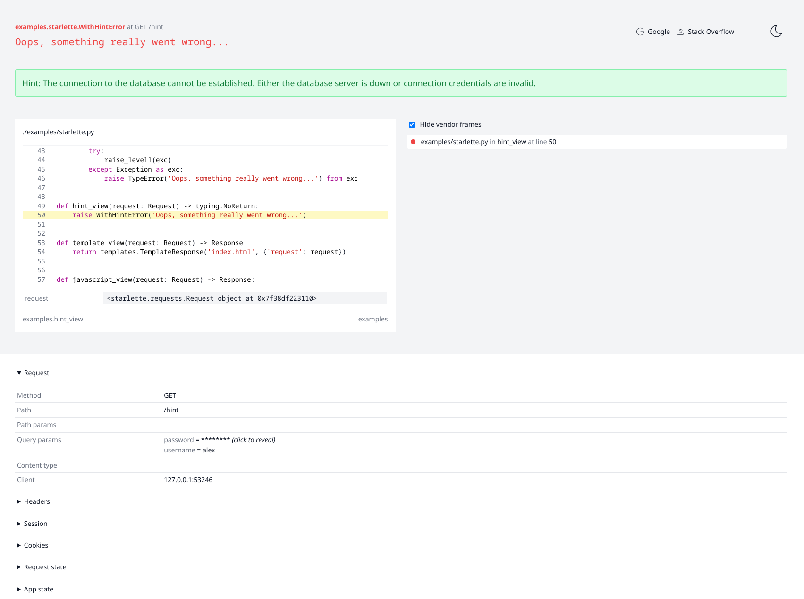

# Starception

Beautiful exception page for Starlette and FastAPI apps.


## Installation

Install `starception` using PIP or poetry:

```bash
pip install starception
# or
poetry add starception
```

## Screenshot



## Features

* secrets masking
* solution hints
* code snippets
* display request info: query, body, headers, cookies
* session contents
* request and app state
* platform information
* environment variables

The middleware will automatically mask any value which key contains `key`, `secret`, `token`, `password`.

## Quick start

See example application in [`examples/`](`examples/`) directory of this repository.

## Usage

To render a beautiful exception page you need to install a custom error handler to your application.
The error handler must be registered to `Exception` class or to `500` status code.

To create the handler use `create_exception_handler(debug: bool)` function.

> Note, the handler won't do anything if `debug=False`,
> instead it will display a plain string "Internal Server Error".
> Also, I would recommend to add it only for local development, as such error page,
> when enabled on production by mistake, can expose sensitive data.

```python
import typing

from starlette.applications import Starlette
from starlette.requests import Request
from starlette.routing import Route

from starception import create_exception_handler


async def index_view(request: Request) -> typing.NoReturn:
    raise TypeError('Oops, something really went wrong...')


app = Starlette(
    routes=[Route('/', index_view)],
    exception_handlers={Exception: create_exception_handler(debug=True)}
)
```

### Integration with FastAPI

Create a FastAPI exception handler and register it with your app:

```python
import typing
from fastapi import FastAPI, Request, Response
from starception import exception_handler

app = FastAPI()


@app.route('/')
async def index_view(request: Request) -> typing.NoReturn:
    raise TypeError('Oops, something really went wrong...')


def custom_exception_handler(request: Request, exc: Exception) -> Response:
    return exception_handler(request, exc, debug=True)
```

## Solution hints

If exception class has `solution` attribute then its content will be used as a solution hint.

```python
class WithHintError(Exception):
    solution = (
        'The connection to the database cannot be established. '
        'Either the database server is down or connection credentials are invalid.'
    )
```


## Credentials

* Look and feel inspired by [Phoenix Framework](https://www.phoenixframework.org/).
